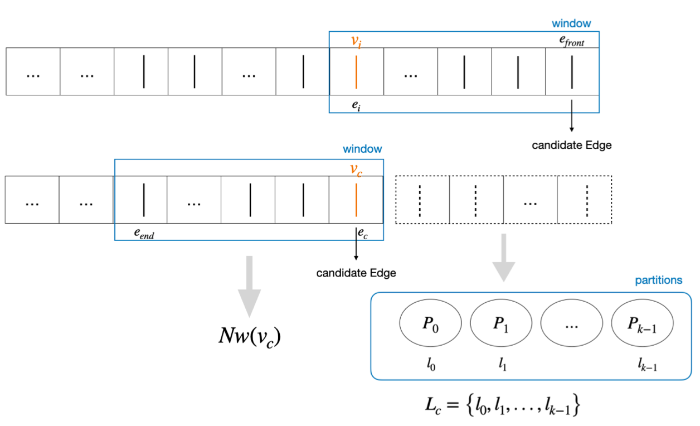

# UniPart
UniPart is a window-based streaming partitioning method tailored for distributed RDF graphs. It operates without the need for global graph information, 
making it exceptionally suited for dynamic environments with unbounded streams and unpredictable data sizes. 
Through testing on the LUBM dataset, it demonstrates clear advantages in load balance, execution time, and memory usage compared to mature partitioning algorithms like METIS, LDG, and WStream.

